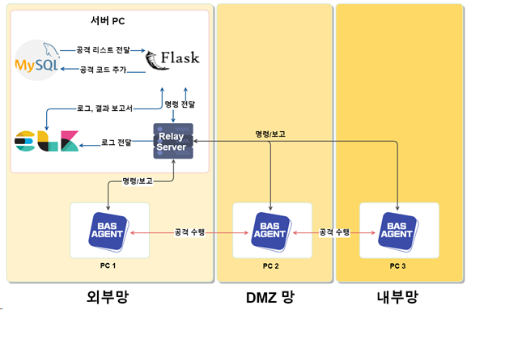

# BAScope: web-server

## BAScope

### 사이버 공격 시뮬레이션 서비스 
기업에 구축된 보안 장비들과 서비스들이 제대로 동작하는지 테스트할 수 있다.  
웹 서버와 TCP 서버를 동일한 PC 에서 실행시키고, 타겟 PC 들에 Agent 를 실행하면 된다.  
기본적으로 Agent 들은 모두 웹/TCP 서버와 통신이 가능해야 한다.  

## System Overview

## System Architecture

 
 

## Main Page

  

## Main Function
- Reconnaissance
    - Nmap
- Attack
    - Packet
    - Malware
    - Exploit-db
    - Social engineering
        - Email
- Report
- Upload Custom Exploit Code
  

## User Manual
- 사이버 공격 시뮬레이션 기능을 제대로 활용하기 위해서는 적어도 2개의 Agent 를 설치해야 한다.
    - Agent A, B 가 있을 때, 출발지 IP 로 A 의 IP 를, 도착지 IP 로 B 의 IP 를 적은 뒤, 원하는 공격을 선택하면 해당 공격을 수행하게 된다.
    - 이 때, 실제 사이버 공격이 아니라 보안 장비만 점검하기 위한 시뮬레이션 공격이기 때문에, 실 서비스에는 악영향을 끼치지 않게 된다.
    - 사이버 공격 시뮬레이션 과정에서 보안 장비가 제대로 작동하였는지 여부를 리포트 형태로 만들어서 제공하게 된다.
        - 이는 공격이 끝나면 자동으로 발생하는 Alert 창을 따라 들어가거나, 수동으로 메인 대시보드에서 Report 메뉴를 눌러도 된다.
        
- 웹 페이지의 Exploit-DB 기능을 제대로 활용하기 위해서는, 선택한 소스 코드를 적절히 수정해주어야 한다.
    - 해당 공격 코드를 실행했을 때 localhost (127.0.0.1) 로 공격 페이로드가 전송되어야 하며,  타겟 포트가 존재하는 경우 Port 위치에 같이 적어주어야 한다. 
    - 이 부분만 성립된다면, 익스플로잇 코드를 마음대로 수정해도 정상적으로 테스트를 진행할 수 있다.
